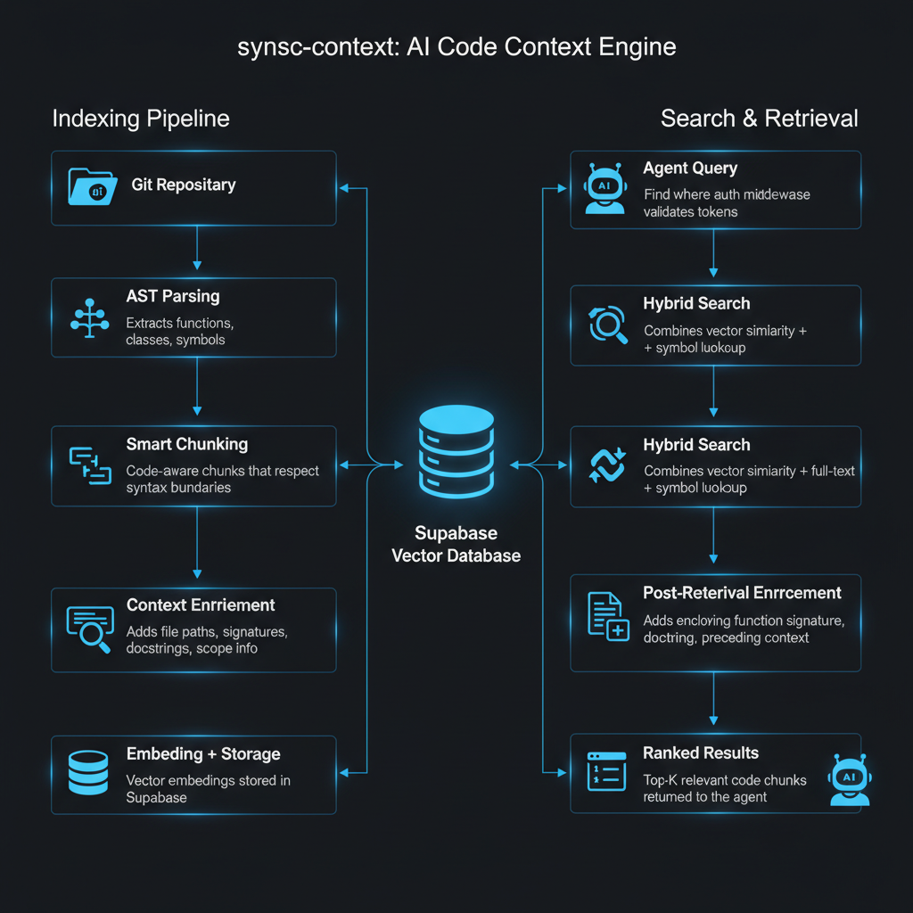
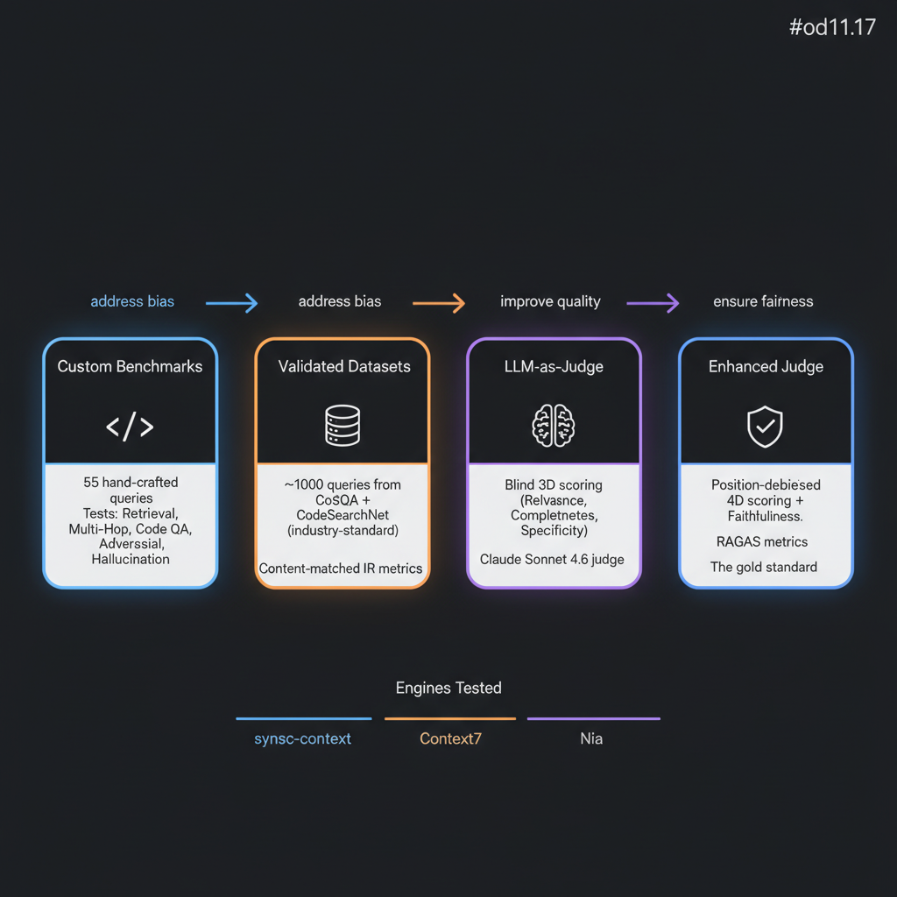
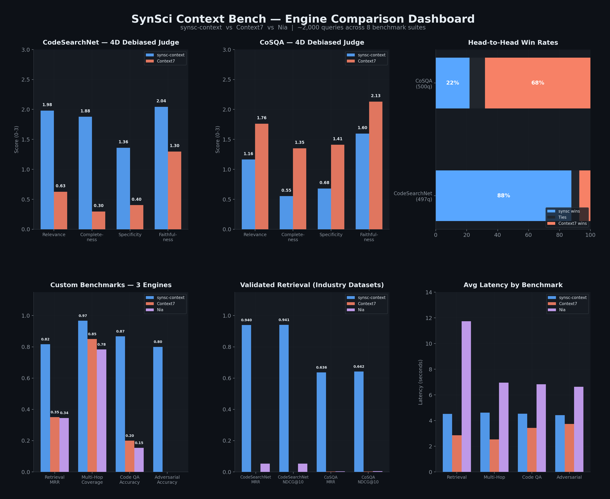

<div align="center">

# SynSci Context Bench

**Benchmark harness for head-to-head comparison of code context engines.**

Tests [synsc-context](https://github.com/synthetic-sciences/synsc-context), [Nia](https://trynia.ai), and [Context7](https://context7.com) across 8 benchmark suites using automated IR metrics and LLM-as-judge evaluation.

[](https://python.org)
[]()
[]()
[]()
[]()

</div>

---

## How It Works

synsc-context is a code context engine that gives AI agents the right code at the right time. This benchmark measures how well it does that compared to alternatives.

<div align="center">

<br/>
<sub>How synsc-context indexes and retrieves code context for AI agents.</sub>
</div>

<br/>

The evaluation runs through 4 phases, each designed to fix fairness problems in the one before it:

<div align="center">

<br/>
<sub>Each phase addresses bias from the prior. Phase 4 (position-debiased 4D scoring) is the gold standard.</sub>
</div>

---

## Results

<div align="center">

</div>

<br/>

**Key takeaways:**

- synsc-context wins **88% of CodeSearchNet queries** on the debiased enhanced judge (436 vs 36 wins). CodeSearchNet tests "find the function that does X" -- the actual use case for AI agents navigating codebases.

- Context7 wins **68% of CoSQA queries** (341 vs 109 wins). CoSQA tests "how do I do X in Python" -- queries an LLM already knows the answer to and would never invoke a context engine for.

- On custom benchmarks (retrieval, multi-hop, code QA, adversarial), synsc-context leads across the board. Nia and Context7 score 0% on adversarial near-miss tests.

<details>
<summary><b>Full results table</b></summary>

<br/>

| Benchmark | Dataset | synsc-context | Nia | Context7 | Winner |
|-----------|---------|:---:|:---:|:---:|:---:|
| Retrieval (MRR) | Custom, 10q | **0.817** | 0.345 | 0.350 | synsc |
| Multi-Hop Coverage | Custom, 10q | **0.967** | 0.783 | 0.850 | synsc |
| Code QA Accuracy | Custom, 15q | **0.867** | 0.154 | 0.200 | synsc |
| Adversarial Accuracy | Custom, 10q | **0.800** | 0.000 | 0.000 | synsc |
| Validated IR (MRR) | CodeSearchNet, 450q | **0.940** | 0.053 | 0.000 | synsc |
| Validated IR (MRR) | CoSQA, 450q | **0.636** | 0.003 | 0.002 | synsc |
| Enhanced Judge (4D) | CodeSearchNet, 497q | **1.815** | -- | 0.655 | **synsc (2.8x)** |
| Enhanced Judge (4D) | CoSQA, 500q | 0.998 | -- | **1.664** | **Context7 (1.67x)** |
| Hallucination Rate | Custom, 10 cases | **40%** | 55.6% | **40%** | synsc / ctx7 |

</details>

---

## Benchmark Suites

| # | Suite | What it tests | Queries |
|:-:|-------|---------------|:-------:|
| 1 | **Retrieval Quality** | Precision@K, Recall@K, NDCG@K, MRR against hand-crafted ground truth | 10 |
| 2 | **Multi-Hop Retrieval** | Queries requiring context from 2+ files/repos | 10 |
| 3 | **Code QA** | Definitions, call sites, imports, inheritance, return types | 15 |
| 4 | **Adversarial Near-Miss** | Decoys: same name/wrong context, test vs prod, version confusion | 10 |
| 5 | **Hallucination Rate** | Does engine context prevent LLM hallucinations? | 10 |
| 6 | **Validated Datasets** | CoSQA + CodeSearchNet (industry-standard, from HuggingFace) | ~900 |
| 7 | **LLM-as-Judge** | Blind 3D scoring: relevance, completeness, specificity | ~1,000 |
| 8 | **Enhanced Judge** | Position-debiased 4D scoring + faithfulness + RAGAS metrics | ~1,000 |

---

## Setup

```bash
uv sync
cp benchmarks/.env.local.example benchmarks/.env.local
# Fill in API keys in .env.local
```

| Variable | Purpose |
|----------|---------|
| `SYNSC_API_URL` | synsc-context server URL (default `http://localhost:8742`) |
| `SYNSC_API_KEY` | synsc-context API key |
| `NIA_API_KEY` | Nia API key |
| `CONTEXT7_ENABLED` | Set `true` to include Context7 |
| `BENCH_LLM_PROVIDER` | `anthropic`, `gemini`, or `openai` (for judge benchmarks) |
| `BENCH_LLM_MODEL` | Model ID for judge benchmarks |
| `BENCH_LLM_API_KEY` | API key for the judge LLM |

## Usage

```bash
# Run everything
uv run python -m benchmarks

# Run specific suites
uv run python -m benchmarks --judge-only --engines synsc context7
uv run python -m benchmarks --retrieval-only --skip-indexing
uv run python -m benchmarks --hallucination-only
uv run python -m benchmarks --enhanced-judge-only

# Quick iteration (limit queries)
uv run python -m benchmarks --judge-only --engines synsc --max-queries 50

# Download CoSQA + CodeSearchNet from HuggingFace
uv run python -m benchmarks --download-datasets

# Multi-model hallucination (test across LLM tiers)
uv run python -m benchmarks --multi-model
```

<details>
<summary><b>All CLI flags</b></summary>

| Flag | Effect |
|------|--------|
| `--engines synsc nia context7` | Select which engines to test |
| `--skip-indexing` | Skip the repo indexing step |
| `--match-mode hybrid\|file\|content` | How to match results to ground truth |
| `--no-debiasing` | Disable position debiasing (2x faster) |
| `--no-significance` | Skip statistical significance analysis |
| `--bootstrap-n N` | Bootstrap resamples (default: 10,000) |
| `--significance-alpha F` | Significance level (default: 0.05) |
| `--dataset cosqa\|codesearchnet` | Run a specific validated dataset |
| `--multi-model` | Hallucination benchmark across model tiers |

Each suite has `--*-only` (run only that suite) and `--skip-*` (skip it) flags.

</details>

---

## Methodology

**Statistical rigor.** All pairwise comparisons include paired t-tests, Wilcoxon signed-rank tests, bootstrap CIs (10K resamples), Cohen's d, Cliff's delta, and Bonferroni correction.

**Position debiasing.** The enhanced judge evaluates each query twice with swapped chunk ordering and averages scores, eliminating the ~10% positional bias documented in LLM evaluations (Zheng et al. 2023).

**Semantic metrics.** Beyond exact-match IR, the harness computes CodeBLEU components, soft token overlap, AST-aware similarity, Success@K, and MAP.

| Fairness concern | How it was addressed |
|------------------|---------------------|
| Custom datasets may favor synsc | Added industry-standard CoSQA + CodeSearchNet |
| Content-matching penalizes text transformation | Added LLM-as-Judge (engine-agnostic) |
| Single-pass judge has positional bias | Added position debiasing |
| Only two engines compared | Added Context7 as third engine |
| Small sample size (50q) | Scaled to 497-500 queries per dataset |
| Judge reliability unknown | Added Cohen's kappa + Position Consistency |

---

## Engine Adapters

Each engine implements the `ContextEngineAdapter` interface:

| Engine | Adapter | Notes |
|--------|---------|-------|
| **synsc-context** | `benchmarks/adapters/synsc.py` | HTTP API, requires indexed repos |
| **Nia** | `benchmarks/adapters/nia.py` | REST API, global knowledge search |
| **Context7** | `benchmarks/adapters/context7.py` | HTTP API, pre-crawled docs |

To add a new engine, implement `ContextEngineAdapter` in `benchmarks/adapters/base.py` and register it in `benchmarks/__main__.py`.

---

## Project Structure

```
benchmarks/
  __main__.py              # CLI entry point
  runner.py                # Orchestrates all suites
  config.py                # Environment config
  metrics.py               # NDCG, MRR, P@K, R@K, MAP, R-Precision
  semantic_metrics.py      # CodeBLEU, soft overlap, AST similarity
  statistical_analysis.py  # Paired tests, bootstrap CIs, effect sizes
  llm_judge.py             # 3D blind scoring
  enhanced_judge.py        # 4D debiased + RAGAS
  validated_eval.py        # CoSQA / CodeSearchNet
  hallucination.py         # Hallucination rate
  multihop.py              # Multi-hop retrieval
  code_qa.py               # Code QA
  adversarial.py           # Adversarial near-miss
  dataset_loader.py        # HuggingFace downloader
  adapters/                # Engine adapters (synsc, nia, context7)
  datasets/                # Ground truth + downloaded datasets
  results/                 # Generated benchmark results (JSON)
docs/
  WHITEPAPER.md            # Technical whitepaper
  BENCHMARK_REPORT.md      # Full analysis
  RESULTS.md               # Tabulated results
  RESULTS.pdf              # PDF export
scripts/
  generate_charts.py       # Generate charts from results.json
  md_to_pdf.py             # Markdown to styled PDF
```

---

## Regenerating Charts

```bash
python scripts/generate_charts.py
```

Uses Gemini for architecture diagrams and matplotlib for the data dashboard. Charts are saved to `assets/charts/`.

---

## References

- Husain et al. (2019). CodeSearchNet Challenge. arXiv:1909.09436.
- Huang et al. (2021). CoSQA: 20,000+ Web Queries for Code Search and Question Answering. ACL 2021.
- Zheng et al. (2023). Judging LLM-as-a-Judge with MT-Bench and Chatbot Arena.
- Shi et al. (2025). Judging the Judges: Evaluating Alignment and Vulnerabilities in LLMs-as-Judges.
- Es et al. (2024). RAGAS: Automated Evaluation of Retrieval Augmented Generation.
- Ren et al. (2020). CodeBLEU: A Method for Automatic Evaluation of Code Synthesis.
- Thakur et al. (2021). BEIR: A Heterogeneous Benchmark for Zero-shot Evaluation of IR Models. NeurIPS.

---

<div align="center">

Built by the [Synthetic Sciences](https://github.com/synthetic-sciences) team.

For questions, reach out to **team@syntheticsciences.ai**

</div>
