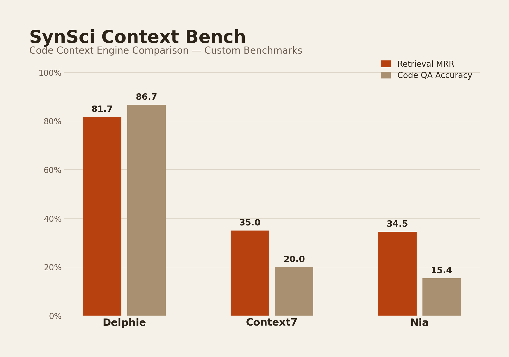

<div align="center">

# SynSci Context Bench

Benchmark harness for comparing code context engines head-to-head.

Tests [Delphi](https://github.com/synthetic-sciences/synsc-delphi), [Context7](https://context7.com), and [Nia](https://trynia.ai) across **11 benchmark phases** — code retrieval, multi-hop, adversarial, hallucination, validated datasets, LLM-as-judge, position-debiased enhanced judge, SWE-Agent code generation, **Thesis workflows** (tool contracts / graph memory / paper QA / artifacts / prior decisions / synthesis), and **real-session replay** of cases where one engine visibly beat another.

[](https://python.org)
[]()
[]()
[]()

<br/>



</div>

---

## Results

100 queries per engine per phase. All validated datasets scored with LLM judge (`--match-mode llm`). Full methodology in [`docs/BENCHMARK_REPORT.md`](docs/BENCHMARK_REPORT.md).

### Custom Benchmarks (100 queries each, 3 engines)

| Benchmark | Metric | Delphi | Context7 | Nia |
|-----------|--------|:---:|:---:|:---:|
| Retrieval | MRR | **0.962** | 0.790 | 0.728 |
| Code QA | Accuracy | **0.310** | 0.270 | 0.263 |
| Adversarial | Discrimination | **0.530** | 0.429 | 0.435 |
| Hallucination | Rate (lower is better) | **40.0%** | 46.0% | 50.0% |

### Validated Datasets (LLM judge, 100 queries each)

| Dataset | Metric | Delphi | Context7 | Nia |
|---------|--------|:---:|:---:|:---:|
| CodeSearchNet | MRR | **0.864** | 0.010 | 0.040 |
| CoSQA | MRR | **0.722** | 0.110 | 0.298 |

### Enhanced LLM Judge (position-debiased, 4D scoring, 100 queries per dataset)

Each query scored twice with swapped chunk ordering to eliminate positional bias. Scored on Relevance, Completeness, Specificity, and Faithfulness (0-3 each).

| Dataset | Engine | Total (0-3) | Wins |
|---------|--------|:-:|:-:|
| CodeSearchNet | **Delphi** | **1.705** | **84** |
| CodeSearchNet | Context7 | 0.410 | 3 |
| CodeSearchNet | Nia | 0.345 | 3 |
| CoSQA | **Delphi** | **1.225** | **51** |
| CoSQA | Nia | 0.875 | 20 |
| CoSQA | Context7 | 0.598 | 12 |

### SWE-Agent Benchmark (25 tasks, gold + agent queries, no-context baseline)

Does feeding context engine results to an LLM actually produce better code? 25 hand-crafted SWE tasks across 3 knowledge tiers.

| Metric | Baseline (no context) | Delphi | Context7 | Nia |
|--------|:---:|:---:|:---:|:---:|
| Judge composite | 0.665 | **0.806** (+21%) | 0.821 (+23%) | 0.802 (+21%) |
| Criteria pass | 90% | **92%** | 88% | 89% |
| Context utilization | — | 12% | 16% | **21%** |

| Knowledge Tier | Delphi delta | Context7 delta | Nia delta |
|----------------|:---:|:---:|:---:|
| A (well-known) | +0.108 | **+0.164** | +0.083 |
| B (niche/recent) | +0.128 | **+0.150** | +0.120 |
| C (version-specific) | **+0.215** | +0.247 | +0.247 |

<details>
<summary>Supplementary: AdvTest (structurally disadvantages library-lookup engines)</summary>

AdvTest uses obfuscated queries without library names, which structurally disadvantages engines like Context7 that require a library name to search. Results are reported separately.

| Dataset | Metric | Delphi | Context7 | Nia |
|---------|--------|:---:|:---:|:---:|
| AdvTest | MRR | **0.970** | 0.000 | 0.030 |

| Dataset | Engine | Total (0-3) | Wins |
|---------|--------|:-:|:-:|
| AdvTest | **Delphi** | **1.740** | **93** |
| AdvTest | Context7 | 0.393 | 2 |
| AdvTest | Nia | 0.365 | 1 |

</details>

---

## Fairness

This benchmark addresses common fairness concerns in engine comparison:

- **LLM-as-Judge** — Claude Sonnet evaluates result quality regardless of format (code vs docs), replacing biased file-path matching
- **Wall-clock latency** — all engines measured identically with `time.perf_counter()`. Delphi averages ~2.2-2.5s/query on production deployment.
- **Position debiasing** — enhanced judge shuffles chunk order to eliminate ~10% positional bias
- **Equal adapter treatment** — no artificial handicaps, equalized timeouts (120s), no fallback libraries
- **Consistent sample size** — 100 queries per engine per phase

---

## What's Being Tested

| # | Phase | Tests | Queries |
|:-:|-------|-------|:------:|
| 1 | **Retrieval Quality** | P@K, Recall@K, NDCG@K, MRR against known ground truth | 100 |
| 2 | **Multi-Hop Retrieval** | Queries needing context from 2+ files/repos | 100 |
| 3 | **Code QA** | Definitions, call sites, imports, inheritance, return types | 100 |
| 4 | **Adversarial Near-Miss** | Decoys: same name/wrong context, test vs prod, version confusion | 100 |
| 5 | **Hallucination Rate** | Does engine context prevent LLMs from making stuff up? | 100 |
| 6 | **CodeSearchNet** | Function-level code search (Husain et al. 2019) | 100 |
| 7 | **CoSQA** | Real web search queries (Huang et al. 2021) | 100 |
| 8 | **Enhanced Judge** | Position-debiased 4D + faithfulness + RAGAS metrics | 200 |
| 9 | **SWE-Agent** | Code generation with/without context, no-context baseline | 25 |
| 10 | **Thesis Workflow** | Tool contracts, graph memory, artifacts, paper QA, multi-turn, prior decisions, avoid-repeat, synthesis | 20 |
| 11 | **Session Replay** | Real moments from production Thesis sessions where one engine beat another | 10 |
| — | *AdvTest (supplementary)* | Adversarial/obfuscated code queries | 100 |

The diagnosis that drove the Phase 10/11 additions: pure code-retrieval benchmarks understate context-engine value-add. Real Thesis work needs graph state, artifacts, tool contracts, papers, and prior-decision memory — that's what Phases 10 and 11 measure.

### Phase 10: Thesis Workflow (categories)

| Category | What it tests |
|----------|---------------|
| `tool_contract` | Find MCP tool schemas and required parameters |
| `graph_memory` | Recall prior nodes, hypotheses, outcomes |
| `artifact` | Find the table/plot/log/diff that supports a claim |
| `paper_qa` | Answer with paper citations |
| `multi_turn` | Continue work from an existing branch |
| `prior_decision` | Locate the rationale behind a choice |
| `avoid_repeat` | Surface prior failed experiments |
| `synthesis` | Combine paper + graph + code context |

Per-category leaderboards are emitted separately so an engine that wins code-retrieval can lose Thesis-workflow without the report hiding it. See `benchmarks/leaderboards.py`.

### Phase 11: Session Replay

Real moments from production Thesis sessions, each labeled with the original failure cause (`missing_index_coverage`, `bad_retrieval`, `bad_ranking`, `bad_packaging`, `tool_ergonomics`, `benchmark_blind_spot`). The replay then re-classifies the failure under the live taxonomy so the report can show "10 cases labeled `bad_retrieval`, now 6 still failing / 2 reclassified as `bad_ranking` / 2 resolved." See `benchmarks/failure_taxonomy.py`.

---

## Quick Start

```bash
uv sync
cp benchmarks/.env.local.example benchmarks/.env.local
# fill in your API keys
```

```bash
# run everything
uv run python -m benchmarks

# run specific phases
uv run python -m benchmarks --skip-indexing --max-queries 100 --match-mode llm -v

# single engine
uv run python -m benchmarks --engines synsc --skip-indexing --max-queries 50

# validated datasets only
uv run python -m benchmarks --validated-only --match-mode llm --dataset codesearchnet cosqa advtest

# enhanced judge only
uv run python -m benchmarks --enhanced-judge-only
```

### Environment Variables

| Variable | What it does |
|----------|-------------|
| `SYNSC_API_URL` | Delphi server URL (default `http://localhost:8742`) |
| `SYNSC_API_KEY` | Delphi API key |
| `NIA_API_KEY` | Nia API key |
| `CONTEXT7_ENABLED` | Set `true` for Context7 |
| `BENCH_LLM_PROVIDER` | `anthropic`, `gemini`, or `openai` |
| `BENCH_LLM_MODEL` | Model ID for judge benchmarks |
| `BENCH_LLM_API_KEY` | API key for the judge LLM |

<details>
<summary>All CLI flags</summary>

| Flag | Effect |
|------|--------|
| `--engines synsc nia context7` | Pick engines |
| `--engines synsc-mcp` | Use Delphi via the MCP proxy (agent-realistic) |
| `--synsc-quality-mode {agent,default}` | Pass-through to the Delphi adapter |
| `--skip-indexing` | Skip repo indexing |
| `--skip-retrieval` | Skip retrieval phase |
| `--skip-multihop` | Skip multi-hop phase |
| `--skip-code-qa` | Skip code QA phase |
| `--skip-adversarial` | Skip adversarial phase |
| `--skip-hallucination` | Skip hallucination phase |
| `--skip-validated` | Skip validated dataset phases |
| `--skip-thesis` | Skip Thesis workflow (Phase 10) |
| `--skip-session-replay` | Skip Session Replay (Phase 11) |
| `--thesis-only` | Run only Thesis workflow |
| `--session-replay-only` | Run only session replay |
| `--validated-only` | Run only validated datasets |
| `--enhanced-judge-only` | Run only enhanced judge |
| `--match-mode llm` | Use LLM judge for validated scoring |
| `--judge-top-k N` | Judge top-N (was hard-coded to 3; default now 10) |
| `--seed N` | RNG seed for query sampling |
| `--num-seeds N` | Run N seeds and aggregate (3-5 for CIs) |
| `--no-debiasing` | Disable position debiasing (2x faster) |
| `--no-significance` | Skip statistical analysis |
| `--dataset cosqa codesearchnet advtest` | Pick specific datasets |
| `--swe-agent-only` | Run only SWE-Agent benchmark |
| `--skip-swe-agent` | Skip SWE-Agent benchmark |
| `--real-patch` | Enable real-patch SWE evaluation (clone + run tests) |
| `--with-agent-queries` | Also run AI-generated queries (default: gold only) |
| `--engines none` | Baseline-only mode (with `--swe-agent-only`) |
| `--max-queries N` | Limit query count per phase |
| `-v` | Verbose logging |

</details>

---

## Statistical Rigor

Every pairwise comparison includes paired t-tests, Wilcoxon signed-rank, bootstrap CIs (10K resamples), Cohen's d, Cliff's delta, and Bonferroni correction. The enhanced judge tracks its own reliability with Cohen's kappa and Position Consistency metrics.

---

## Engine Adapters

| Engine | Adapter | Notes |
|--------|---------|-------|
| **Delphi** | `benchmarks/adapters/synsc.py` | HTTP API, needs indexed repos |
| **Nia** | `benchmarks/adapters/nia.py` | REST API, global knowledge search |
| **Context7** | `benchmarks/adapters/context7.py` | HTTP API, pre-crawled docs |

Add a new engine by implementing `ContextEngineAdapter` from `benchmarks/adapters/base.py`.

---

## Project Structure

```
synsci-context-bench/
├── README.md                  this file
├── ARCHITECTURE.md            high-level design + diagnosis traceability
├── CHANGELOG.md               release notes (1.0 → 1.1 → reorg)
├── CONTRIBUTING.md            how to add phases / engines / metrics
├── pyproject.toml
│
├── benchmarks/
│   ├── README.md              package overview
│   ├── __main__.py            cli entry point
│   ├── runner.py              phase orchestrator
│   ├── config.py              env + path config (curated_dir, validated_dir, seeds)
│   │
│   ├── adapters/              one file per engine
│   │   ├── synsc.py           Delphi HTTP (quality_mode aware)
│   │   ├── synsc_mcp.py       Delphi MCP-proxy (build_context_pack)
│   │   ├── nia.py             Nia REST (full-latency accounted)
│   │   ├── context7.py        Context7 HTTP (full-latency accounted)
│   │   └── base.py            ContextEngineAdapter interface
│   │
│   ├── phases/                one module per benchmark phase
│   │   ├── multihop.py        Phase 2
│   │   ├── code_qa.py         Phase 3
│   │   ├── adversarial.py     Phase 4
│   │   ├── hallucination.py   Phase 5
│   │   ├── validated_eval.py  Phase 6 — CodeSearchNet / CoSQA / AdvTest
│   │   ├── swe_agent.py       Phase 9 — code generation benchmark
│   │   ├── swe_real_patch.py  Phase 9b — real-patch eval (opt-in)
│   │   ├── thesis.py          Phase 10 — Thesis workflow
│   │   └── session_replay.py  Phase 11 — production session replay
│   │
│   ├── judges/                LLM-as-judge implementations
│   │   ├── llm_judge.py       3D blind scoring
│   │   └── enhanced_judge.py  4D position-debiased + RAGAS
│   │
│   ├── scoring/               deterministic scoring + analysis
│   │   ├── metrics.py         MRR, NDCG, P@K, R@K (dedup-fixed), MAP
│   │   ├── semantic_metrics.py     CodeBLEU + AST similarity
│   │   ├── context_grounding.py    citation, utilization, hallucination-reduction
│   │   ├── leaderboards.py    per-category leaderboards
│   │   ├── failure_taxonomy.py     classify failures into actionable buckets
│   │   └── statistical_analysis.py paired tests, bootstrap, effect sizes
│   │
│   ├── infra/                 operational glue
│   │   ├── logging_config.py  structured logging + per-query traces
│   │   ├── sampling.py        seeded + stratified sampling
│   │   ├── latency.py         end-to-end latency meter
│   │   └── consistency.py     repeat-run consistency checks
│   │
│   ├── utils/                 standalone helpers
│   │   ├── dataset_loader.py  downloads CodeSearchNet / CoSQA / ...
│   │   └── create_benchmark_repo.py  fixture builder
│   │
│   ├── datasets/
│   │   ├── curated/           hand-built cases owned by this repo
│   │   │   ├── retrieval_ground_truth.json
│   │   │   ├── multihop_test_cases.json
│   │   │   ├── code_qa_test_cases.json
│   │   │   ├── adversarial_test_cases.json
│   │   │   ├── hallucination_test_cases.json
│   │   │   ├── swe_agent_test_cases.json
│   │   │   ├── thesis_test_cases.json
│   │   │   └── session_replay_cases.json
│   │   └── validated/         downloaded standard datasets
│   │       ├── codesearchnet_benchmark.json
│   │       ├── cosqa_benchmark.json
│   │       ├── advtest_benchmark.json
│   │       └── ...
│   │
│   └── results/               run_<ts>/ directories — traces, manifests, CSVs
│
├── docs/
│   ├── README.md              docs index
│   ├── PHASES.md              per-phase deep dive
│   ├── METRICS.md             per-metric reference
│   └── BENCHMARK_REPORT.md    last full-run report
│
├── scripts/
│   └── generate_charts.py     regenerate assets/charts/results.png
│
└── assets/
    └── charts/
```

Every subdirectory has its own `README.md` that describes what's in it
and the local conventions.

---

## Regenerate the Chart

```bash
python scripts/generate_charts.py
```

---

## References

Husain et al. (2019) CodeSearchNet Challenge. arXiv:1909.09436 ·
Huang et al. (2021) CoSQA. ACL 2021 ·
Zheng et al. (2023) Judging LLM-as-a-Judge ·
Shi et al. (2025) Judging the Judges ·
Es et al. (2024) RAGAS ·
Ren et al. (2020) CodeBLEU ·
Thakur et al. (2021) BEIR. NeurIPS

---

<div align="center">

Built by the [Synthetic Sciences](https://github.com/synthetic-sciences) team

Questions? **hello@syntheticsciences.ai**

</div>
